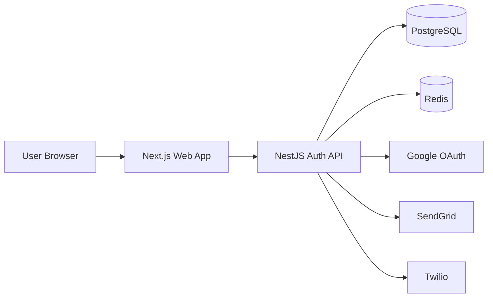

# AuthKit

Universal authentication starter developers can clone and extend.

## Stack

- NestJS (API)
- Next.js (web starter)
- PostgreSQL
- Redis

## Features

- Google OAuth 2.0
- JWT access + refresh token rotation
- MFA via SMS (Twilio) or Email (SendGrid)
- Redis session and challenge caching
- Email verification flow

## Project structure

```text
authkit/
  apps/
    api/
      src/
        auth/       # auth flows + guards + strategies
        users/      # user entity/service
        common/     # redis/sms/mail adapters
        config/     # env validation + auth constants
        database/   # data source, migrations, seed
    web/
      src/
        app/                # Next.js route entry
        features/auth/      # auth API client + state hook + types
  docker-compose.yml
```

## Architecture



- `apps/web` is a lightweight auth playground and integration shell.
- `apps/api` owns auth business logic, token rotation, OAuth, MFA, and profile endpoints.
- `PostgreSQL` stores durable user/auth data, while `Redis` stores short-lived sessions/challenges.
- External providers are isolated behind `common` services for easier swapping/mocking.

## Quick start

1. Install dependencies:

   ```bash
   npm install
   ```

2. Copy environment values:

   ```bash
   copy .env.example .env
   copy apps\api\.env.example apps\api\.env
   copy apps\web\.env.example apps\web\.env
   ```

3. Start Postgres + Redis:

   ```bash
   docker compose up -d
   ```

4. Run DB migrations and seed demo users:

   ```bash
   npm run db:setup --workspace api
   ```

5. Run both apps:

   ```bash
   npm run dev
   ```

Apps run at:

- API: `http://localhost:3000`
- Web: `http://localhost:3001`

Default local DB credentials:

- Host: `127.0.0.1`
- Port: `5433`
- User: `authkit_user`
- Password: `authkit_pass_123`
- Database: `authkit`

## Auth API endpoints

- `POST /auth/register`
- `POST /auth/verify-email`
- `GET /auth/verify-email?token=...`
- `POST /auth/login`
- `POST /auth/mfa/verify`
- `PATCH /auth/mfa`
- `POST /auth/refresh`
- `POST /auth/logout`
- `GET /auth/google`
- `GET /auth/google/callback`
- `GET /auth/me`

## Database scripts (API)

- `npm run migration:run --workspace api`
- `npm run migration:revert --workspace api`
- `npm run seed --workspace api`
- `npm run db:setup --workspace api`

Seeded demo users:

- `demo@authkit.dev` / `Authkit123!`
- `demo-mfa@authkit.dev` / `Authkit123!` (email MFA enabled)

## Environment variables

See `.env.example` for all required variables:

- `GOOGLE_CLIENT_ID`, `GOOGLE_CLIENT_SECRET`
- `JWT_ACCESS_SECRET`, `JWT_REFRESH_SECRET`
- `SENDGRID_API_KEY`, `SENDGRID_FROM_EMAIL`
- `TWILIO_ACCOUNT_SID`, `TWILIO_AUTH_TOKEN`, `TWILIO_FROM_PHONE`
- `POSTGRES_*`, `REDIS_*`
- `NEXT_PUBLIC_API_URL`

## Notes

- Without SendGrid/Twilio credentials, the API logs verification/MFA codes to console (safe for local development only).
- The web app home page includes a minimal auth playground to exercise register/login/verify/MFA/refresh/logout flows.
- Contributor onboarding guide: `CONTRIBUTING.md`
